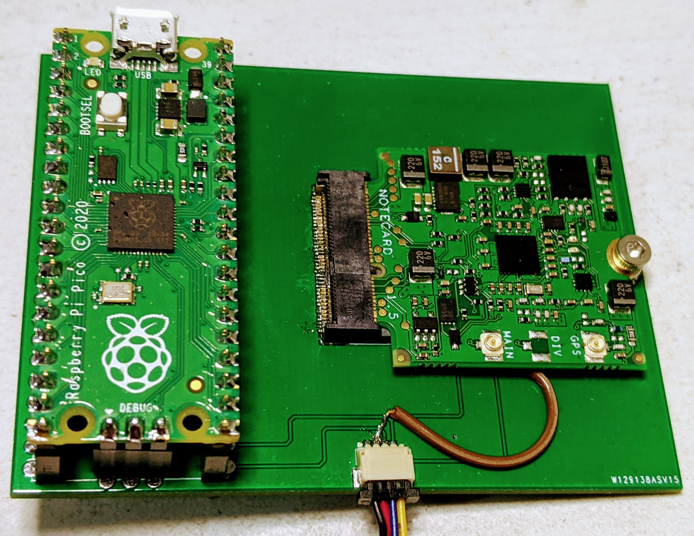

# pico_carrier
Pico carrier board for the Blues Notecard

## TO DO ##
1. ~~Fix Eagle Lbr~~
2. ~~Fix PCB~~
3. Design StemmaQT Form factor

In the picture below, Raspberry Pi Pico interfaced to the [Blues Notecard](https://blues.io/)

